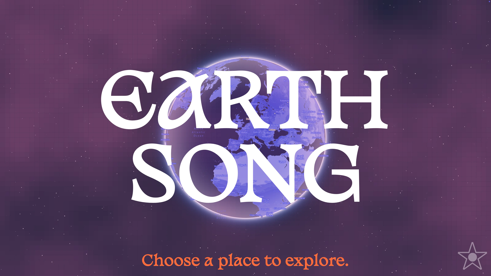

# Earthsong

https://earthsong.world/

# Huge 2025 EARTH SONG update is here!

- EARTH SONG is now fully responsive and compatible with mobile devices and tablets. All features, including special audio effects work on mobile!
- Added universal navigation menu to easily move between different parts of the application.
- Added extensive “help” documentation (accessible via the GUIDE menu item) that explains how to interact with different parts of Earthsong.
- Big upgrades to journey snapshot SAVE and RECALL functionality.
- Location and sound fetching are now faster and more robust.
- Entire application is now in TypeScript!
- Fixed numerous bugs and inconsistencies.
- Many enhancements to the Earthsong Sound Portal.
- Adjusted animations and visual elements to run more smoothly and efficiently.

## EARTH SONG is...

- a portal for exploring the sounds of other places
- a tool for sonic inspiration
- a surprising and unpredictable sonic adventure

## What does it do?

- Listen to sounds from anywhere on Earth
- Discover surprising interactions and harmonies between sounds
- Build your own soundscapes in EARTH SONG's interactive 3-dimensional Sound Portal
- Mutate and transform sounds in real-time: reverse direction, change playback speed, "tune" sounds to each other

## How does it work?

- Choose a place to explore by selecting a point on the map
- EARTH SONG searches [freesound.org](https://freesound.org/) - a massive collaborative database of user-contributed audio recordings - for sounds from that location
- 5 sounds are selected at random and loaded into the EARTH SONG Sound Portal, a sonic playground where you can audition, manipulate and mix sounds to create your own custom sound environment
- Registered users can save and recall their favorite journeys

## Technologies

- Next.js
- TypeScript/JavaScript
- Node.js with RESTful API
- PostgreSQL
- [p5.js](https://p5js.org/) for animation and sound visualization.
- [tone.js](https://tonejs.github.io/) for sound playback and manipulation.
- [mapbox](https://www.mapbox.com/) for the interactive globe.
- Sounds are sourced from [Freesound.org](https://freesound.org/), a collaborative database of user-contributed audio content. All sounds are released under Creative Commons licenses that allow their reuse.

## Thanks to

- [Sara El Abed](https://github.com/saraelaela), [Anton Kolomoiets](https://github.com/antonkolo) and [Lukas Prochazka](https://github.com/ProchaLu) for technical and emotional support.
- [Michael Jeffrey Lee](https://www.michaeljeffreylee.com/) for the name EARTH SONG, which is also a song from the forthcoming [Budokan Boys](https://budokanboys.club/) album, THE OOZE.
- [Sunny Sun](https://decodingnature.nyuadim.com/author/ss14740/), who shared [cloud sim](https://editor.p5js.org/ss14740/sketches/z-cEmTUPD), the p5 sketch that Earthsong’s cloud overlay animation was adapted from.
- [Freesound.org](https://freesound.org/) and all who contribute to it.

https://earthsong.world/
